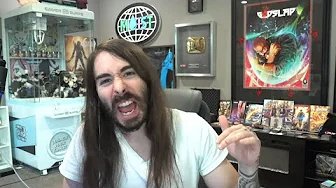
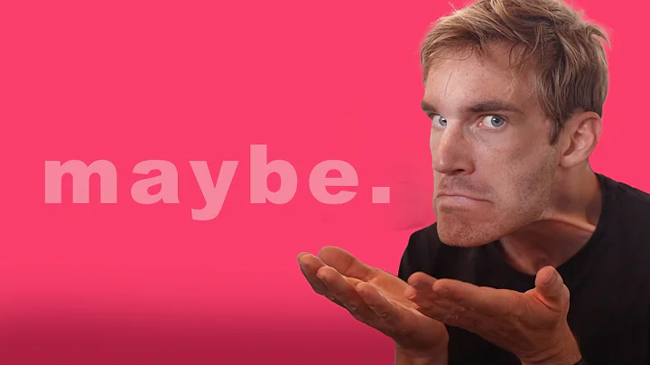
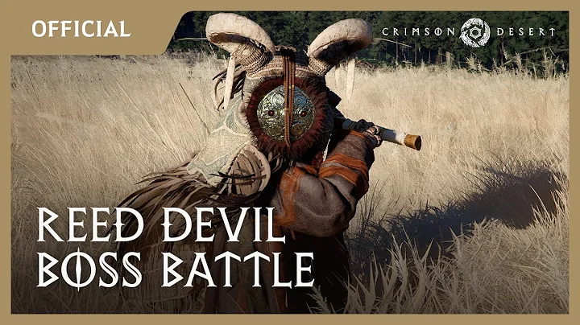
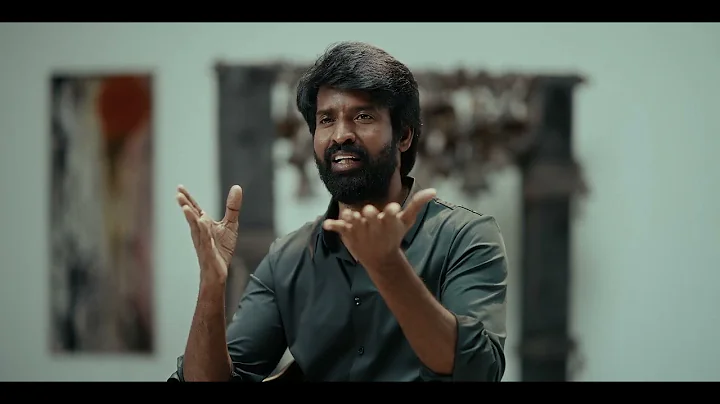
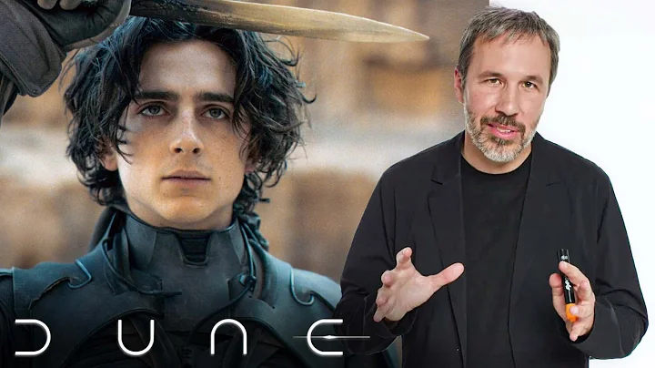
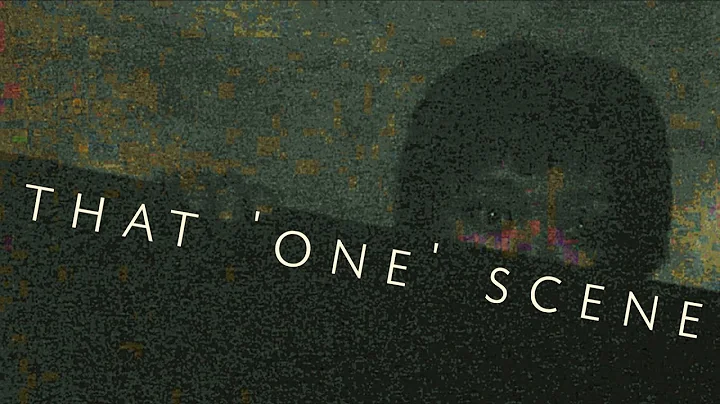
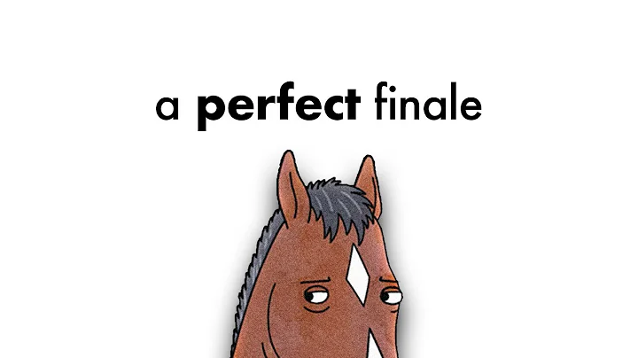
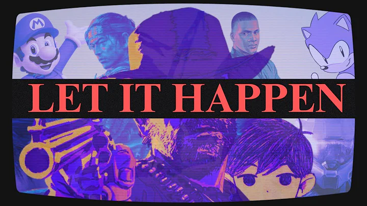
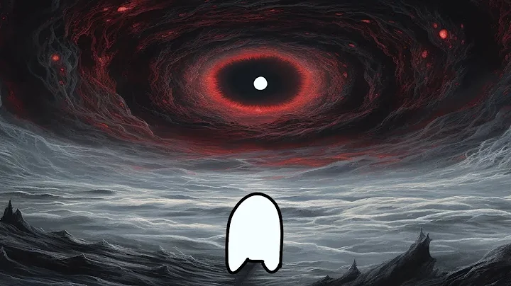

<!DOCTYPE html>
<html>
    <head>
        <title>Youtube</title>
        <link rel="stylesheet" href="youtube.css">
        <link rel="stylesheet" href="header.css">
        <link rel="stylesheet" href="general.css">
        <link rel="stylesheet" href="sidebar.css">
        <link rel="preconnect" href="https://fonts.googleapis.com">
<link rel="preconnect" href="https://fonts.gstatic.com" crossorigin>
<link href="https://fonts.googleapis.com/css2?family=Roboto:wght@400;500;700&display=swap" rel="stylesheet">
    </head>
    <!--HEAD-->

    <!--BODY-->
    <body>
        <!--HEADER-->
        <header class="header">
            
 
                
                
            

            

                <input type="text" placeholder="Search" class="Searchbar">
                <button class="search-button"> 
                
search 

                </button>
                <button class="voice-search"> 
                    
Search with your voice

                </button>

            

            

                

                    
                    
Create

                

                

                    
YouTube apps

                

                

                    
                    
Notifications

                    
3

                

                

                

                
            

        </header>
        <!--SIDEBAR-->
        <nav class="sidebar">
            

                
                
Home

            

            

                
                
Explore

            

            

                
                
Subscriptions

            

            

                
                
Originals

            

            
 
                
                
Youtube Music

            

            

                
                
Library

            

        </nav>
        <!--MAIN-->
        <main>
            <section class="display-grid">
                <!--videos-->
                

                    
 
                        
14:20
 
                    

                    

                        
  
                            

                                

                                    

                                    

                                        
Marques Brownlee

                                        
19.3M subscribers

                                    

                                

                            

                        

                        

                            

                                Talking Tech and AI with Google CEO Sundar Pichai!
                            

                            

                                Marques Brownlee
                            

                            

                                3.4M views · 6 months ago
                            

        
                        

                    

                

                <!--END-->
        
                

                    
 
8:22

                    

                        
 
                            

                                

                                    

                                    

                                        
Markiplier

                                        
36.9 subscribers

                                    

                                

                            
 
                        

                        

                            

                                Try Not To Laugh Challenge #9
                            

                            

                                Markiplier
                            

                            

                                19M views · 4 years ago
                            

        
                        

                    

                

    
                

                    
  
11:31

                    

                        
 
                            

                                

                                    

                                    

                                        
penguinz0

                                        
15.8M subscribers

                                    

                                

                            
 
                         
                        

                        

                            

                                I Used to Hate This                            

                            

                                penguinz0

                            

                                1.2M views · 5 days ago
                                
                            

        
                        

                    

                

        
                

                    
 
21:05
 

                    

                        
 
                            

                                

                                    

                                    

                                        

                                            PewDiePie
                                        

                                        
111M subscribers

                                    

                                

                            

                        

                        

                            

                                MAYBE
                            

                            

                                PewDiePie
                            

                            

                                1.3M views · 1 day ago
                            

        
                        

                    

                

    
                

                    
  
11:17

                    

                        
  
                            

                                

                                    

                                    

                                        
Crimson Desert

                                        
57.5k subscribers

                                    

                                

                            

                        

                        

                            

                                Crimson Desert – Reed Devil Boss Battle Gameplay |...
                            

                            

                                Crimson Desert
                            

                            

                                1.1M views · 5 days ago
                            

        
                        

                    

                

        
                

                    
  
19:59

                    

                        
 
                            

                                

                                    

                                    

                                        

                                            MrBeast
                                        

                                        
312M subscribers

                                    

                                

                            

                        

                        

                            

                                Anything You Can Fit In The Circle I’ll Pay For
                            

                            

                                MrBeast
                            

                            

                                19M views · 4 years ago
                            

        
                        

                    

                

                

                    
 
                        
2:21
 
                    

                    

                        
 
                            

                                

                                    

                                    

                                        
Sivakarthikeyan Productions

                                        
225k subscribers

                                    

                                

                            

                         

                        

                            

                                Kottukkaali - Making of the Interval | Featurette - E3 | Soori | Anna Ben | PS...
                            

                            

                                Sivakarthikeyan Productions
                            

                            

                                14,485 views · 20 hours ago
                            

        
                        

                    

                

                

                    
 
                        
17:34
 
                    

                    

                        
 
                            

                                

                                    

                                    

                                        
Vanity Fair

                                        
4.36M subscribers

                                    

                                

                            

                        

                        

                            

                                ‘Dune’ Director Denis Villeneuve Breaks Down a Scene | Vanity Fair

                            

                                Vanity Fair
                            

                            

                                4.9M views · 2 years ago
                            

        
                        

                    

                

                

                    
 
                        
8:12
 
                    

                    

                        
  
                            

                                

                                    

                                    

                                        
Spikima Movies

                                        
7.7M subscribers

                                    

                                

                            

                        

                        

                            

                                Kairo | Anatomy Of The Scariest Scene Ever
                            

                            

                                Spikima Movies
                            

                            

                                7.7M views · 4 years ago
                            

        
                        

                    

                

                

                    
 
                        
10:03
 
                    

                    

                        
 
                            

                                

                                    

                                    

                                        
Karsten Runquist 

                                        
699K subscribers

                                    

                                

                            

                        

                        

                            

                                why bojack horseman's finale is perfect
                            

                            

                                Karsten Runquist  
                            

                            

                                624K views · 4 years ago
                            

        
                        

                    

                

                

                    
 
                        
2:46
 
                    

                    

                        
 
                            

                                

                                    

                                    

                                        
KnubNight 

                                        
3.38K subscribers

                                    

                                

                            

                        

                        

                            

                                "just let it happen"
                            

                            

                                KnubNight
                            

                            

                                438K views · 3 weeks ago 
                            

        
                        

                    

                

                

                    
 
                        
4:58
 
                    

                    

                        
 
                            

                                

                                    

                                    

                                        
Absurdyssey 

                                        
4.51K subscribers

                                    

                                

                            

                        

                        

                            

                                Do not gaze into the Abyss | Nietzsche
                            

                            

                                Absurdyssey
                            

                            

                                264K views · 4 months ago
                            

        
                        

                    

                

            </section>
        </main>
        <footer style="height: 50px;"></footer>
        
        
    </body>
</html>
